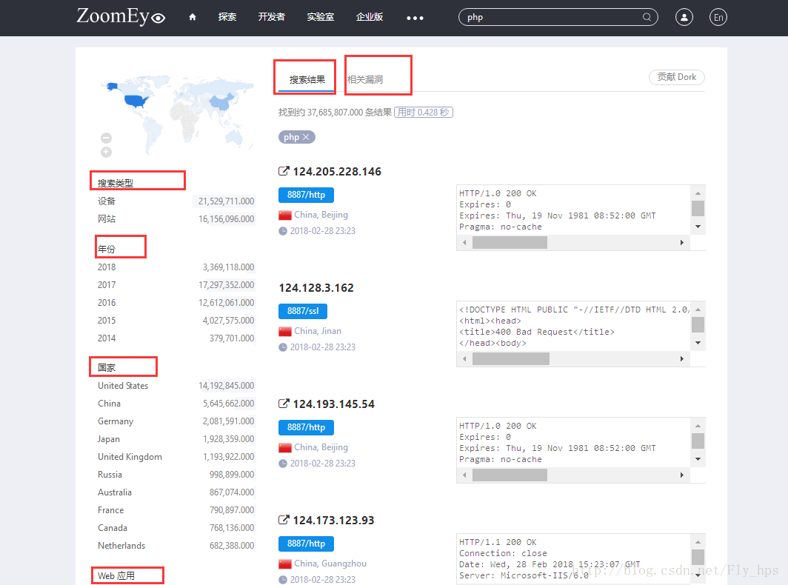
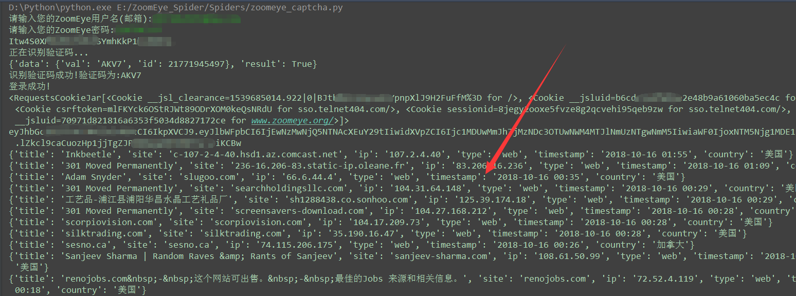
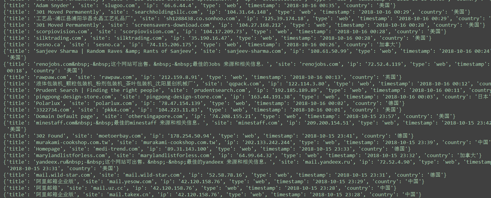

Python实现ZoomEye钟旭之眼的登录+关键字爬取 
===========================
   
### ZoomEye钟旭之眼 - https://www.zoomeye.org/
|Author|:sunglasses:Henryhaohao:sunglasses:|
|---|---
|Email|:hearts:1073064953@qq.com:hearts:

      
****
## :dolphin:声明
### 软件均仅用于学习交流，请勿用于任何商业用途！感谢大家！
## :dolphin:介绍
### 该项目为[ZoomEye钟旭之眼](https://www.zoomeye.org/)的模拟登录+关键字爬取
- ZoomEye介绍:
> - 参考文章: https://blog.csdn.net/Fly_hps/article/details/79406517
- 项目版本:
> - 版本一:手动填写验证码进行登录:Spiders/zoomeye.py
> - 版本二:自动识别验证码进行登录:Spiders/zoomeye_captcha.py (我这里接入的是[联众打码](https://www.jsdati.com/)平台)
## :dolphin:运行环境
Version: Python3
## :dolphin:安装依赖库
```
pip3 install -r requirements.txt
```
## :dolphin:**相关截图**
> - **ZoomEye钟旭之眼官网 - https://www.zoomeye.org/**<br><br>

> - **运行过程**<br><br>


## :dolphin:**总结**
> **最后，如果你觉得这个项目不错或者对你有帮助，给个Star呗，也算是对我学习路上的一种鼓励！<br>
 哈哈哈，感谢大家！笔芯哟~**:cupid::cupid:


